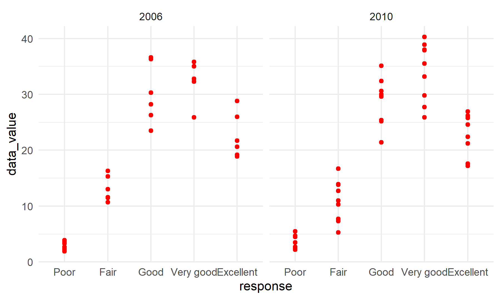

```{r setup, include=FALSE}
library(tidyverse)
library(p8105.datasets)

knitr::opts_chunk$set(
  fig.width = 6,
  fig.asp = .6,
  out.width = "90%"
)
theme_set(theme_minimal() + theme(legend.position = "bottom"))
options(
  ggplot2.continuous.colour = "viridis",
  ggplot2.continuous.fill = "viridis"
)
scale_colour_discrete = scale_colour_viridis_d
scale_fill_discrete = scale_fill_viridis_d
```

## Problem 1

Loading data.
```{r}
data("instacart")
instacart %>%
  head(3)
```
Short description:
This dataset has 1384617 rows and 15 columns. Each row represent a single item ordered and each column represent a feature/information of that order. Key variables are "aisle", "product_name", "order_dow", "order_hour_of_day" and so on. For example, the first line means user 112108 ordered bulgarian yogurt from aisle yogurt in department dairy eggs at ten o'clock on Thursday.
```{r}
ai_df = instacart %>%
  count(aisle) %>%
  arrange(-n)
  knitr::kable(head(ai_df[1:4, ]))
```

There are 134 aisles and the most items ordered from "fresh vegetables" and "fresh fruits" aisles.

```{r}
ai_plot = instacart %>%
  count(aisle) %>%
  filter(n > 10000) %>%
  mutate(aisle = factor(aisle),
         aisle = fct_reorder(aisle, n)) %>% 
  ggplot(aes(x = aisle, y = n)) + geom_point(colour = "#FF0000FF") + 
  theme(axis.text.x = element_text(angle = 90, hjust = 0.5, vjust = 0.5))

ggsave("ai_plot.png")
knitr::include_graphics("ai_plot.png")  
```

Most of them are less than 40000.

```{r}
bdp_df = instacart %>%
  filter(aisle %in% c("baking ingredients", 
                      "dog food care", 
                      "packaged vegetables fruits")) %>%  
  group_by(aisle, product_name) %>%
  summarise(n_times = n()) %>%
  top_n(n = 3)
  knitr::kable(bdp_df)
```

The most popular item in “baking ingredients”, “dog food care”, and “packaged vegetables fruits” is "Light Brown Sugar" (499), "Snack Sticks Chicken & Rice Recipe Dog Treats" (30) and "Organic Baby Spinach" (9784) respectively.

```{r}
pc_df = instacart %>%
  filter(product_name %in% c("Pink Lady Apples",
                             "Coffee Ice Cream")) %>%
  group_by(product_name, order_dow) %>%
  summarise(mean_hour = mean(order_hour_of_day)) %>%
  pivot_wider(
    names_from = order_dow,
    values_from = mean_hour
  ) 

colnames(pc_df) = c('product_name', 'Sun', 'Mon', 
                    'Tue', 'Wed', 'Thu', 'Fri', 'Sat')
knitr::kable(pc_df)
```
The mean hour of ordering of coffee ice cream is greater than that of pink lady apples except for Friday.

## Problem 2

Do some data cleaning.
```{r}
data("brfss_smart2010")

brfss_df = brfss_smart2010 %>%
  janitor::clean_names() %>%
  filter(topic == "Overall Health", response %in% 
           c("Excellent","Very good","Good","Fair","Poor")) %>%
  mutate(response = recode(response,
        "Poor" = "1","Fair" = "2","Good" = "3",
        "Very good" = "4","Excellent" = "5"
        )) %>% 
      arrange(response) %>%  
  mutate(response = recode(response,
        "1" = "Poor","2" = "Fair","3" = "Good",
        "4" = "Very good","5" = "Excellent"
    ))
colnames(brfss_df)[2:3] = c("state","location")
knitr::kable(head(brfss_df[1:4, ]))
```

```{r}
st_loc02 = brfss_df %>%
  filter(year == "2002") %>%
  group_by(state) %>%
  summarise(location = n()) %>%
  filter(location >= 7) %>%
  arrange(-location)
knitr::kable(head(st_loc02[1:4, ]))

st_loc10 = brfss_df %>%
  filter(year == "2010") %>%
  group_by(state) %>%
  summarise(location = n()) %>%
  filter(location >= 7) %>%
  arrange(-location)
knitr::kable(head(st_loc10[1:4, ]))
```
In 2002, there were 36 states that were observed at 7 or more locations and Pennsylvania were observed at 50 locations. In 2010, there were 45 states that were observed at 7 or more locations and Florida were observed at 205 locations. 

```{r}
spag_df = brfss_df %>%
  filter(response == "Excellent") %>%
  group_by(state, year) %>%
  summarise(mean_data_value = mean(data_value, na.rm = TRUE)) %>% 
  ggplot(aes(x = year, y = mean_data_value,
                    color = state), show.legend = FALSE) + 
  geom_line(aes(group = state), alpha = 0.5) + 
  theme(legend.position = "right")

ggsave("spag_plot.png")
knitr::include_graphics("spag_plot.png")
```

Different states had different trends. Most of mean_data_value were between 15 and 30.

```{r}
panel_df = brfss_df %>%
  filter(state == "NY",
         year %in% c("2006", "2010")) %>% 
  mutate(response = factor(
    response, levels = c("Poor", "Fair", "Good",
                         "Very good", "Excellent"))) %>% 
  ggplot(aes(x = response, y = data_value)) + 
  geom_point(colour = "#FF0000FF") + 
  facet_grid(.~year)

ggsave("two_panel_plot.png")

```

The distributions of data_value for responses in NY State are similar for the year 2006 and 2010.

## Problem 3
```{r}
accel_df = read_csv("./accel_data.csv") %>% 
  janitor::clean_names() %>%
  mutate(
    week_class = ifelse(
      day %in% c("Sunday", "Saturday"), "Weekend", "Weekday"),
    week = as.integer(week),
    day_id = as.integer(day_id)) %>% 
  relocate(week, day_id, day, week_class)
knitr::kable(head(accel_df[1:4, ]))
```
This dataset has 35 observations and 1444 variables. Variables include "week", "day_id", "day", "week_class" and 1440 "activity_i" variables which are the activity counts for each minute of a 24-hour day starting at midnight.

```{r}
agg_min_df = accel_df %>%
  mutate(activity_day = rowSums(accel_df[,c(5:1444)])) %>%
  relocate(week, day_id, day, week_class, activity_day)

tot_df = agg_min_df %>%
  group_by(day) %>%
  summarise(tot_act = sum(activity_day))
knitr::kable(tot_df)
```

The patient usually has higher activity counts at the middle of a week, i.e. Wednesday, Thursday and Friday.

```{r}
accel_panel_df = accel_df %>%
  pivot_longer(
    activity_1:activity_1440,
    names_to = "activity_min",
    values_to = "activity_counts",
    names_prefix = "activity_"
  ) %>%
  mutate(activity_min = as.numeric(activity_min)) %>%
  group_by(day, activity_min ) %>%
  summarise(sum_activity_counts = sum(activity_counts)) %>%
  filter(sum_activity_counts > 2000) %>%
  mutate(day = factor(
    day, levels = c("Sunday", "Monday", "Tuesday",
                         "Wednesday", "Thursday", "Friday", "Saturday"))) %>%
  ggplot(aes(x = activity_min, y = sum_activity_counts, 
           group = day, color = day)) + 
  geom_point(alpha = 0.5) 

ggsave("accel_panel_plot.png")
knitr::include_graphics("accel_panel_plot.png")
```

The activity counts rose significantly on Friday around 9 PM and Saturday around 11 AM.


